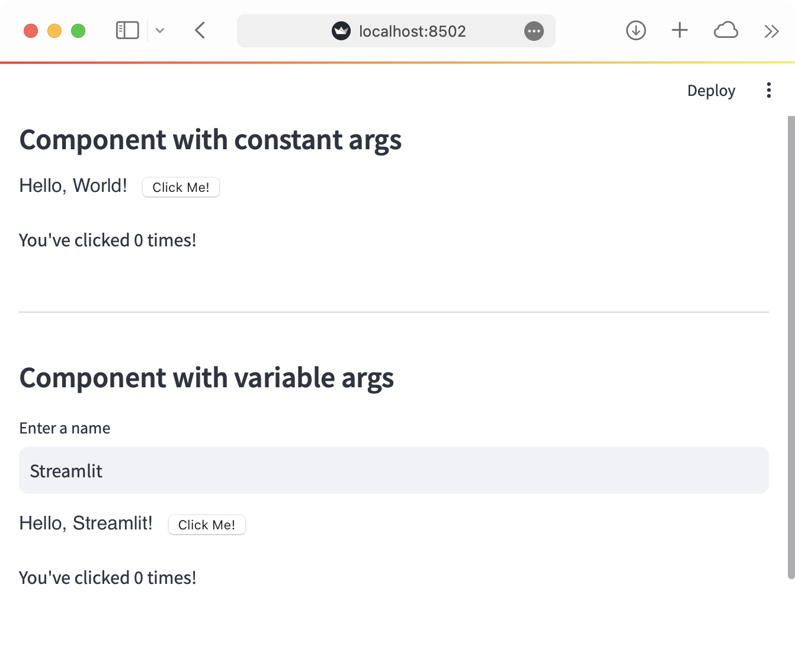

# Streamlit Vue Vite Templates

This repo contains templates and example code for creating [Streamlit](https://streamlit.io) Components.

For complete information, please see the [Streamlit Components documentation](https://docs.streamlit.io/en/latest/streamlit_components.html)!

## Quickstart

* Ensure you have [Python 3.6+](https://www.python.org/downloads/), [Node.js](https://nodejs.org), and [npm](https://docs.npmjs.com/downloading-and-installing-node-js-and-npm) installed.
* Clone this repo.
* Create a new Python virtual environment for the template:
```
$ cd streamlit-component-vue-vite-template
$ python3 -m venv venv   # create venv
$ . venv/bin/activate    # activate venv
$ pip install streamlit  # install streamlit
```
* Initialize and run the component template frontend:
```
$ cd streamlit-component-vue-vite-template/my_component/frontend
$ npm install    # Install npm dependencies
$ npm run dev    # Start the Vite dev server
```
* From a separate terminal, run the template's Streamlit app:
```
$ cd streamlit-component-vue-vite-template
$ . venv/bin/activate  # activate the venv you created earlier
$ streamlit run my_component/example.py  # run the example
```
* If all goes well, you should see something like this:

* Modify the frontend code at `my_component/frontend/src/MyComponent.tsx`.
* Modify the Python code at `my_component/__init__.py`.
